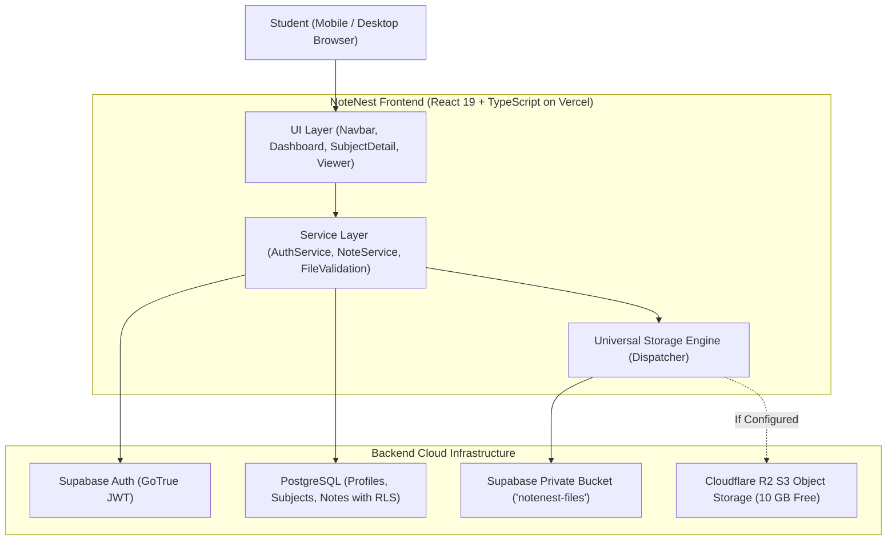

# NoteNest

<p align="center">
  
</p>

<p align="center">
  <strong>Your notes. Organized.</strong>
  <br />
  A clean, minimalist, academic note organizer for college students to store and manage PDF study materials by subject.
</p>

<p align="center">
  <a href="https://note-nest-5gef.vercel.app/"></a>
  <a href="https://github.com/thejasteju54-lgtm/NoteNest/blob/main/LICENSE"></a>
  <a href="https://github.com/thejasteju54-lgtm/NoteNest/actions"></a>
  
  
  
</p>

---

## 📖 The Problem NoteNest Solves

College students frequently receive essential lecture notes, syllabus PDFs, and previous-year question papers via chaotic WhatsApp and Telegram study groups.

Over time:
- 📉 Important PDFs get buried under hundreds of chat messages.
- 🗂️ Study materials for different subjects get scrambled together.
- ⏳ Students waste hours scrolling through old group conversations right before exams.
- 📱 Files often appear lost or expire from local phone storage.

**NoteNest solves this.** Students can create dedicated subject folders (e.g. *Calculus, Operating Systems, Machine Learning*) and organize all their PDF notes in a secure, searchable, cloud-backed personal vault.

---

## ✨ Key Features

- 📁 **Subject Folders**: Organize study materials into custom color-coded academic subjects.
- 📄 **Fast PDF Uploads & Validation**: Layered file validation (file extension, MIME type, 50MB size limit, and binary `%PDF-` signature verification).
- 🔍 **Instant Global & Scoped Search**: Debounced search across subject names, note titles, and files.
- 👁️ **In-App PDF Viewer**: Read lecture notes directly within NoteNest with zoom, print, download, and new-tab controls.
- 🔐 **Hardened Authentication**: Pure Supabase Auth with disposable/burner email domain blocking and strong password defense.
- 🛡️ **Multi-Tenant Row-Level Security (RLS)**: PostgreSQL database policies ensure your notes and files remain 100% private to your account.
- ☁️ **High-Capacity Storage Engine**: Built-in universal storage manager supporting **Cloudflare R2 (10 GB Free)** with transparent fallback to **Supabase Storage (1 GB)**.
- 📱 **Mobile-First Responsive Design**: Fluid bottom navigation bar, safe-area support, and touch-optimized action targets for smartphones and tablets.
- 💾 **Data Portability**: One-click JSON backup export and restore.

---

## 🌐 Live Application

Experience NoteNest in production:
🔗 **[https://note-nest-5gef.vercel.app/](https://note-nest-5gef.vercel.app/)**

---

## 🛠️ Technology Stack

| Layer | Technology | Description |
| :--- | :--- | :--- |
| **Frontend Framework** | [React 19](https://react.dev/) + [TypeScript](https://www.typescriptlang.org/) | Single Page Application with strict type-safety |
| **Bundler & Tooling** | [Vite 6](https://vitejs.dev/) | Sub-second HMR and optimized production bundling |
| **Styling & Aesthetics** | [Tailwind CSS](https://tailwindcss.com/) | Academic color tokens, glassmorphism, and responsive utilities |
| **Authentication** | [Supabase Auth](https://supabase.com/auth) | Email/password auth, JWT sessions, and password strength checks |
| **Database** | [Supabase PostgreSQL](https://supabase.com/database) | Relational store with Row-Level Security (RLS) policies |
| **Object Storage** | [Cloudflare R2](https://www.cloudflare.com/products/r2/) / [Supabase Storage](https://supabase.com/storage) | User-scoped private PDF storage with signed URLs |
| **Testing** | [Vitest](https://vitest.dev/) | Automated unit, integration, and security test suite |
| **Hosting & CI/CD** | [Vercel](https://vercel.com/) + [GitHub Actions](https://github.com/features/actions) | Continuous deployment with automated build/test pipelines |

---

## 🏛️ Architecture Overview



For in-depth architectural specifications, see [docs/architecture.md](docs/architecture.md).

---

## 🚀 Quick Start & Local Setup

### 1. Clone the repository
```bash
git clone https://github.com/thejasteju54-lgtm/NoteNest.git
cd NoteNest
```

### 2. Install dependencies
```bash
npm install
```

### 3. Configure Environment Variables
Copy `.env.example` to `.env`:
```bash
cp .env.example .env
```

Add your Supabase project credentials (obtain from [Supabase Settings -> API](https://supabase.com/dashboard)):
```env
VITE_SUPABASE_URL=https://your-project.supabase.co
VITE_SUPABASE_ANON_KEY=your-anon-publishable-key
```

### 4. Setup Database Tables & RLS Policies
In your Supabase SQL Editor, run the script provided in [`docs/architecture/supabase_schema.sql`](docs/architecture/supabase_schema.sql).

### 5. Start the local server
```bash
npm run dev
```
Open `http://localhost:5173` in your browser.

---

## 📂 Project Structure

```text
NoteNest/
├── .github/
│   ├── ISSUE_TEMPLATE/        # Bug report & feature request templates
│   ├── workflows/ci.yml       # Automated GitHub Actions test & build pipeline
│   └── pull_request_template.md
├── docs/                      # Engineering documentation & database guides
│   ├── architecture.md        # Deep-dive architecture & data flow
│   ├── database.md            # Schema, RLS policies, indexes & triggers
│   ├── setup.md               # Complete developer onboarding guide
│   └── screenshots/           # UI walkthrough assets
├── public/                    # Scalable vector assets & PWA manifest
├── src/
│   ├── components/            # Focused, reusable UI components
│   │   ├── auth/              # Route guards & auth widgets
│   │   ├── common/            # Buttons, Modals, Badges, Inputs, Logo
│   │   ├── dashboard/         # GreetingBanner, SubjectGrid, RecentNotes
│   │   ├── layout/            # Navbar, MobileNav, Breadcrumbs
│   │   ├── notes/             # NoteCards, NoteList, NoteItems
│   │   ├── search/            # SearchResultsView
│   │   ├── settings/          # Storage metrics & backup controls
│   │   ├── subjects/          # SubjectDetailView, SubjectModals
│   │   └── viewer/            # PDFViewerModal
│   ├── context/               # AuthContext, NoteNestContext, ToastContext
│   ├── hooks/                 # Reusable custom hooks
│   ├── repositories/          # Interface-driven database & storage engines
│   ├── services/              # Business logic, file validation & auth services
│   ├── types/                 # TypeScript data contracts & interfaces
│   └── utils/                 # Formatters & auth validation
├── tests/                     # Automated Vitest test suite (34+ tests)
├── .env.example               # Safe environment variable template
├── package.json
├── tsconfig.json
├── vercel.json                # Security headers & SPA rewrites
└── vite.config.ts
```

---

## 🧪 Testing & Code Quality

NoteNest includes a full Vitest test suite verifying authentication rules, file binary signature checks, storage engine dispatchers, and multi-tenant RLS isolation:

```bash
# Run all unit and integration tests
npm test

# Run TypeScript typecheck
npm run typecheck

# Run production build
npm run build
```

---

## 🗺️ Roadmap

- [x] Pure Supabase email/password authentication & session persistence
- [x] Disposable/burner email domain blacklist
- [x] Multi-tenant PostgreSQL Row-Level Security (RLS) isolation
- [x] 4-layer file security validation (Extension, MIME, Size, Magic `%PDF-` bytes)
- [x] In-app private PDF viewer with time-limited signed URLs
- [x] High-capacity Cloudflare R2 (10 GB) storage engine integration
- [x] Native mobile bottom navigation & touch responsiveness
- [x] One-click JSON data backup export & import
- [ ] Multi-PDF batch upload
- [ ] Tagging & semester categorization
- [ ] Note sharing with expiring access links

---

## 🤝 Contributing

Contributions are welcome! Please read our [CONTRIBUTING.md](CONTRIBUTING.md) guide and [CODE_OF_CONDUCT.md](CODE_OF_CONDUCT.md) before opening a pull request.

To find issues you can help with, check out the [good first issue](https://github.com/thejasteju54-lgtm/NoteNest/issues?q=is%3Aissue+is%3Aopen+label%3A%22good+first+issue%22) label.

---

## 📄 License

Distributed under the **MIT License**. See [`LICENSE`](LICENSE) for more information.

---

## 👨‍💻 Maintainer

Created and maintained by **Thejas** ([@thejasteju54-lgtm](https://github.com/thejasteju54-lgtm)) with the NoteNest open-source community.
