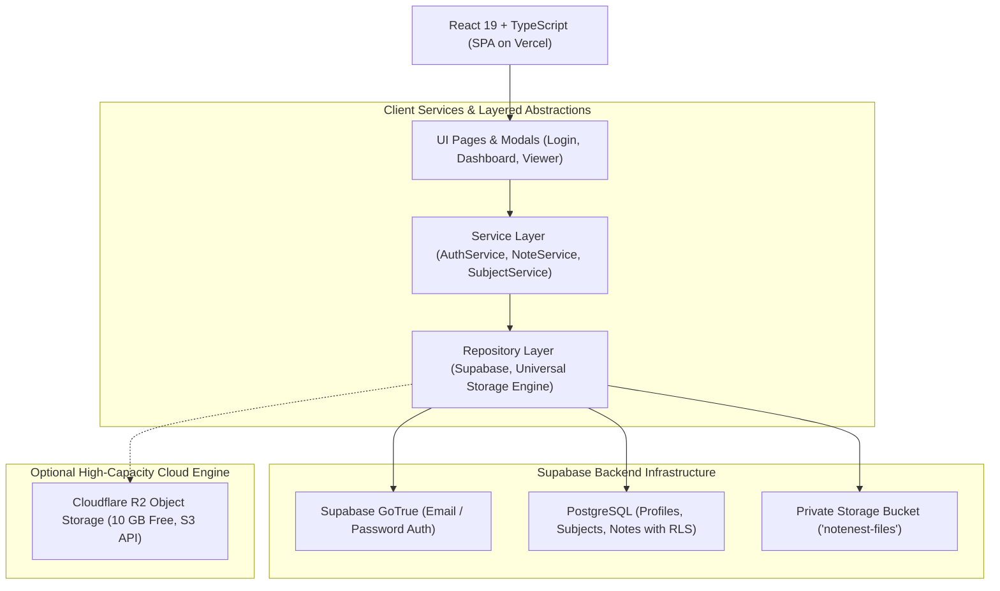

# NoteNest Architecture & System Design

This document details the engineering architecture, data flow, component boundaries, and security model of NoteNest.

---

## 🏛️ High-Level System Architecture

---

## 🧩 Architectural Layers & Responsibilities

### 1. Presentation Layer (`src/components/`, `src/pages/`)
- **Pages**: `Login.tsx`, `Signup.tsx`, and dynamic views (`Dashboard`, `SubjectDetailView`, `SettingsView`).
- **Layout**: Sticky header with responsive navigation, mobile bottom navigation bar (`MobileNav.tsx`), and breadcrumbs.
- **Modals**: Focus-trapped, touch-friendly modals with ESC dismiss and smooth animations (`UploadModal.tsx`, `SubjectModal.tsx`, `PDFViewerModal.tsx`).

### 2. State & Context Layer (`src/context/`, `src/hooks/`)
- **`AuthContext.tsx`**: Manages user authentication state, session persistence, token refreshes, sign in, sign up, sign out, and resend confirmation emails.
- **`NoteNestContext.tsx`**: Manages global application state (active subjects, cached notes, search queries, active modals, and data re-validation).
- **`ToastContext.tsx`**: Lightweight, queue-based feedback notifications with auto-dismissal.

### 3. Service Layer (`src/services/`)
- **`authService.ts`**: Encapsulates email validation (blocking disposable domains like tempmail), password complexity enforcement, and authentication calls.
- **`noteService.ts`**: Handles note creation, renaming, destination moves, searching, sorting, and private blob downloads.
- **`fileValidationService.ts`**: Implements 4-layer file security validation (extension check, MIME verification, 50MB file size limit, and `%PDF-` binary magic bytes signature verification).
- **`backupService.ts`**: Generates and imports portable JSON archive backups.

### 4. Repository Layer (`src/repositories/`)
- **Interface-driven design**: Every data store implements strict contracts (`ISubjectRepository`, `INoteRepository`, `IFileStorageRepository`).
- **`UniversalStorageManager`**: Automatically routes uploads and signed URLs to **Cloudflare R2 (10 GB)** when configured, with seamless transparent fallback to **Supabase Cloud Storage (1 GB)**.

---

## 🔒 Security & Data Isolation Model

1. **Multi-Tenant Row-Level Security (RLS)**:
   - Every row in `profiles`, `subjects`, and `notes` is strictly bound to `auth.uid() = user_id`.
   - Any query executed by the client automatically scopes down to only records owned by the authenticated student at the PostgreSQL engine level.
2. **Private Storage Isolation**:
   - Bucket `notenest-files` is private (`public = false`).
   - File paths are formatted as: `{userId}/{subjectId}/{timestamp}-{uuid}.pdf`.
   - Storage RLS ensures that `(storage.foldername(name))[1] = auth.uid()::text`.
3. **HTTP Security Headers (`vercel.json`)**:
   - `Content-Security-Policy`: Restricts scripts to self and Supabase endpoints.
   - `X-Frame-Options: DENY`: Protects against clickjacking.
   - `X-Content-Type-Options: nosniff`: Prevents MIME-sniffing vulnerabilities.
   - `Strict-Transport-Security`: Enforces HSTS across all subdomains.
