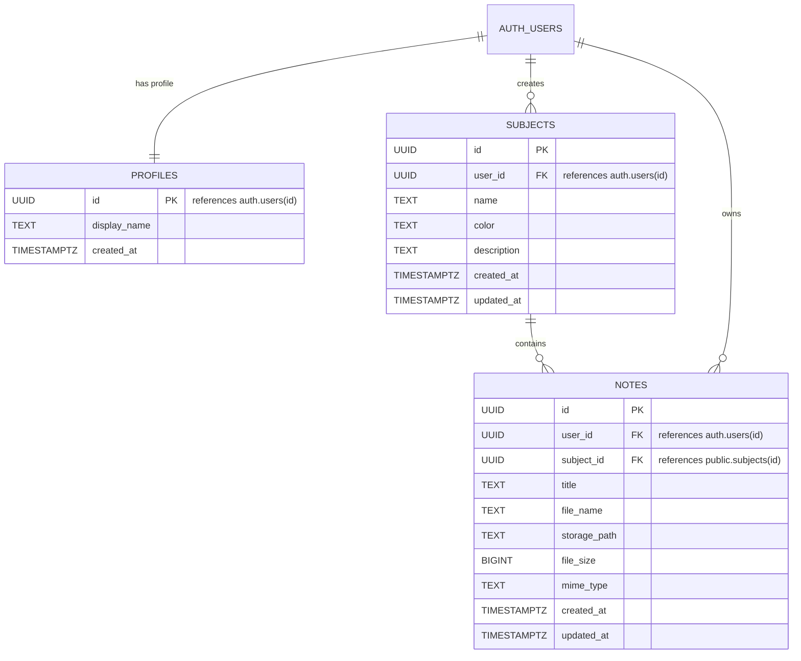

# NoteNest Database & Storage Schema Documentation

This document describes the PostgreSQL database tables, relationships, indexes, Row-Level Security (RLS) policies, and storage structure used by NoteNest.

---

## 📊 Entity Relationship Diagram (ERD)



---

## 🗄️ Table Definitions

### 1. `public.profiles`
Stores user profile information linked directly to `auth.users`.
- `id` (UUID, Primary Key): Foreign key referencing `auth.users(id)` with cascading delete.
- `display_name` (TEXT): Student's visible name.
- `created_at` (TIMESTAMPTZ): Timestamp of profile creation.

### 2. `public.subjects`
Folders/categories representing academic courses or subjects.
- `id` (UUID, Primary Key): Unique subject identifier.
- `user_id` (UUID, Foreign Key): Identifier of the student owning this subject.
- `name` (TEXT): Name of the subject (e.g., Mathematics, Computer Networks).
- `color` (TEXT): Color theme identifier (`sage`, `blue`, `amber`, `rose`, `indigo`, etc.).
- `description` (TEXT, Optional): Brief notes on the course or semester.
- `created_at` (TIMESTAMPTZ): Creation timestamp.
- `updated_at` (TIMESTAMPTZ): Last modified timestamp (auto-updated by trigger).

### 3. `public.notes`
PDF document records linked to subjects.
- `id` (UUID, Primary Key): Unique note identifier.
- `user_id` (UUID, Foreign Key): Owner ID.
- `subject_id` (UUID, Foreign Key): Destination subject ID with cascading delete.
- `title` (TEXT): User-facing title for the note.
- `file_name` (TEXT): Original file name.
- `storage_path` (TEXT): Path pointer within cloud object storage.
- `file_size` (BIGINT): Size in bytes.
- `mime_type` (TEXT): Content type (enforced as `application/pdf`).
- `created_at` (TIMESTAMPTZ): Upload timestamp.
- `updated_at` (TIMESTAMPTZ): Last updated timestamp.

---

## ⚡ Performance Indexes

```sql
CREATE INDEX idx_subjects_user_id ON public.subjects(user_id);
CREATE INDEX idx_notes_user_id ON public.notes(user_id);
CREATE INDEX idx_notes_subject_id ON public.notes(subject_id);
CREATE INDEX idx_notes_user_subject ON public.notes(user_id, subject_id);
CREATE INDEX idx_notes_created_at ON public.notes(created_at DESC);
```

---

## 🛡️ Row-Level Security (RLS) Policies

All tables enforce multi-tenant isolation through PostgreSQL Row-Level Security:

| Table | Operation | Policy Rule | Target |
| :--- | :--- | :--- | :--- |
| `profiles` | SELECT / UPDATE / INSERT | `auth.uid() = id` | `authenticated` |
| `subjects` | SELECT / INSERT / UPDATE / DELETE | `auth.uid() = user_id` | `authenticated` |
| `notes` | SELECT / INSERT / UPDATE / DELETE | `auth.uid() = user_id` | `authenticated` |

---

## 📦 Cloud Storage Security

The `notenest-files` bucket is configured with private access:
- **Path format**: `{userId}/{subjectId}/{timestamp}-{uuid}.pdf`
- **Storage Policy**: `(storage.foldername(name))[1] = auth.uid()::text`
- Ensures students can only upload, read, update, or delete files inside their own user ID folder.
